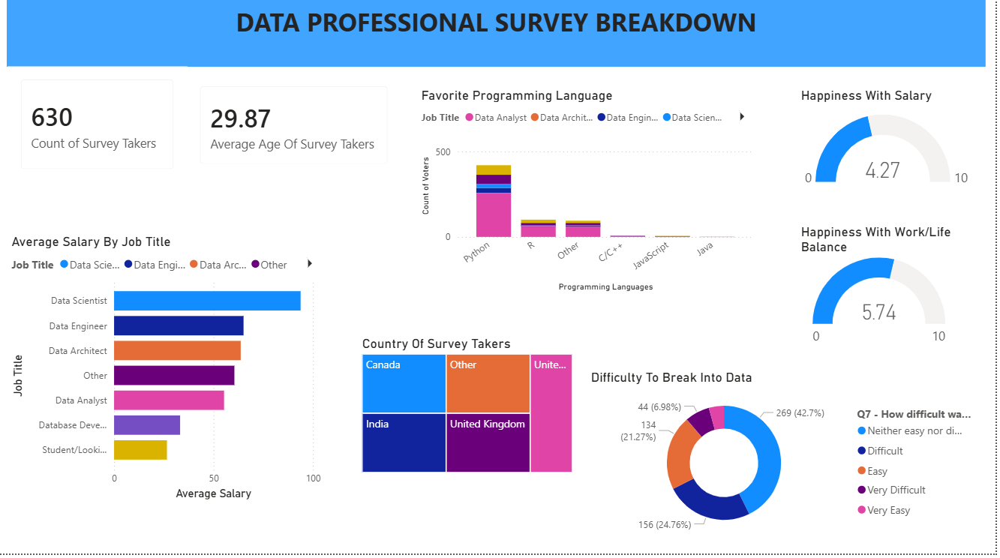

# Survey PowerBi Project
This is a Power BI data professional survey breakdown project featuring an engaging dashboard report. It aims to provide insights into how various factors, such as career transitions, salary ranges, and job satisfaction, influence the career dynamics of data professionals.

## Project Objective:
The objective of this project is to develop a Power BI dashboard that visually analyzes survey data from data professionals to:
- Identify Trends: Highlight key trends in career paths, salary ranges, and job satisfaction across various roles.
- Understand Career Dynamics: Explore how factors like industry, education, and programming skills impact the career experiences of data professionals.
- Facilitate Decision-Making: Provide actionable insights for organizations to enhance recruitment strategies, improve employee retention, and boost job satisfaction.
- Support Career Development: Inform aspiring data professionals about the challenges and opportunities in breaking into the field.

---

## Datasets:

- [Original Dataset](https://github.com/sarfarazalamgit/survey-powerbi-project/blob/main/original%20dataset.xlsx)
- [Project.pbix](https://github.com/sarfarazalamgit/survey-powerbi-project/blob/main/Project.pbix)

---

## Questions (KPIs)
# Dashboard Insights

This Power BI dashboard provides valuable insights into the landscape of data professionals. Below are important questions that can be addressed through the analysis:

1. **What is the average salary for different job titles in the data field?**
   - Helps assess compensation trends and identify salary disparities.

2. **How does location affect salary and job satisfaction?**
   - Reveals how geographical factors influence earnings and work experiences.

3. **What programming languages are most popular among data professionals?**
   - Identifies skill trends that can guide education and training programs.

4. **How satisfied are data professionals with their salaries?**
   - Provides insights into whether compensation aligns with industry expectations.

5. **What is the overall happiness level concerning work/life balance in the data profession?**
   - Highlights the importance of work/life balance in employee satisfaction.

---

## Process
1. Verify data for any missing values and anomalies, and sort out the same.
2. Ensure data is consistent and clean with respect to data type, data format, and values used.
3. Create dashboards according to the questions asked.

---

## Dashboard

---

## Project Insights
1. The average salary for different job titles in the data field are:
- Data Scientist - 93.78K Dollars
- Data Engineer - 65.09K Dollars
- Data Architect - 63.67K Dollars
- Data Analyst - 55.30K Dollars
- Database Developer - 33.20K Dollars
- Student/Looking/None - 26.58K Dollars
- Other - 60.49K Dollars

2. People are most satisfied with their salaries in the United States, while those in India are the least satisfied.
3. Python and R are the most popular programming languages among data professionals.
4. Data Scientists and Database Developers are the most satisfied data professionals with their salaries, while others report lower satisfaction levels.
5. Overall happiness level concerning work/life balance in the data profession - 5.74/10.

---

## Final Conclusion
To improve job satisfaction among data professionals, strategies should target the disparities in average salaries, especially for Data Analysts and Students/Job Seekers. Companies should consider tailored compensation packages to enhance satisfaction, particularly in regions with lower ratings, such as India.

With Python and R being the most popular programming languages, promoting training in these areas can aid talent retention. Additionally, with a work/life balance happiness score of 5.74 out of 10, organizations should implement initiatives that foster better work/life integration. These efforts will contribute to a more satisfied and engaged workforce in the data field.
